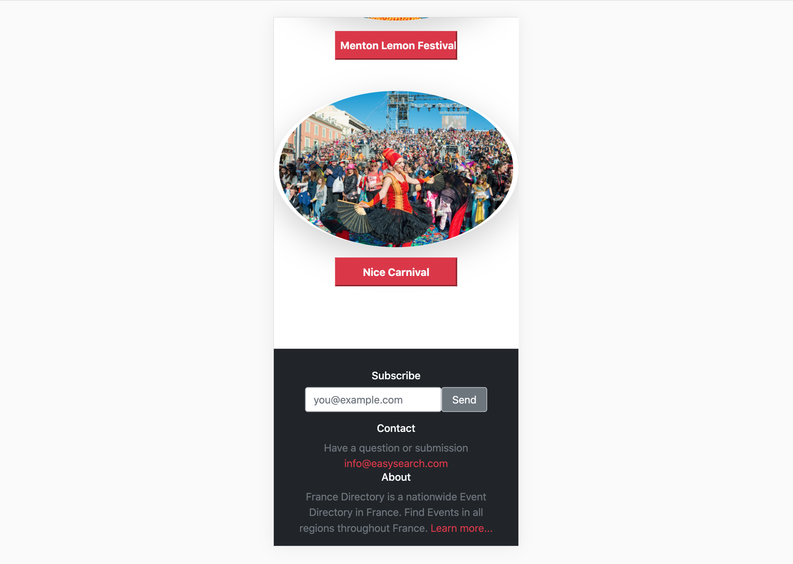
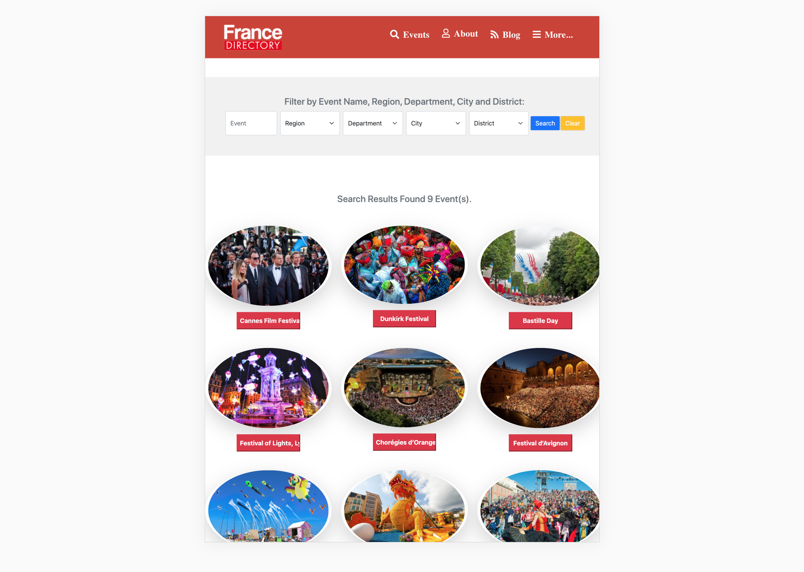

# Online-Events-Directory

> This is a Website for Events-Directory consisting of 3 interlinked webpages.
>- the main page (search page), with a link to the results page
>- the search results page, with a list of Events each with a link to the Event details page
>- Event details page

# Screenshot

### Main Search Page: Mobile

### Main Search Page: Tablet

### Main Search Page: Desktop

### Result Page - Header : Mobile

### Result Page - Footer : Mobile

### Result Page: Tablet

### Details Page: Desktop

## Built With

- HTML
- CSS
- Bootstrap

## Live Demo

[Live Demo Link](https://vagyasri.github.io/Events-Directory/)

## Author

👤 **Bhagyashree Patra**

- GitHub: [@githubhandle](https://github.com/Vagyasri)
- Twitter: [@twitterhandle](https://twitter.com/Lucky86074644)
- LinkedIn: [LinkedIn](https://www.linkedin.com/in/bhagyashree-patra-029bb059/)

## Getting Started

### Prerequisites:

- Web browser
- Code Editor
- Live Server Extension

### Cloning the repo to your local system (If you already have git, installed in your system):

- [Copy this link](git@github.com:Vagyasri/Events-Directory.git)
- Open your terminal or command line
- Run git clone [Paste this link](git@github.com:Vagyasri/Events-Directory.git)
- Open the folder with your code editor
- Now You can edit the code and check the changes in the browser using Live Server

### Check linter errors:

- Install npm
- For HTML: Run npx hint .
- For CSS: Run npx stylelint “**/*.css”

## 🤝 Contributing

### Contributions, issues, and feature requests are welcome!

### Start by:

- Forking the project
- Cloning the project to your local machine
- cd into the Youtube-Replica project directory
- Run git checkout -b your-branch-name
- Make your contributions
- Push your branch up to your forked repository
- Open a Pull Request with a detailed description to the development branch of the original project for a review

### Feel free to check the [issues page](https://github.com/Vagyasri/Events-Directory/issues), contribute to the Project by creating an issue.

## Show your support

### Give a ⭐️ if you like this project!

## Acknowledgments
- Project originally taken from The Odin Project
- Project inspired by Microverse Program
- Thanks for this Website Design "PATASHULE"
- Matthew Njuguna & Sam Achola (Design from Behance)
